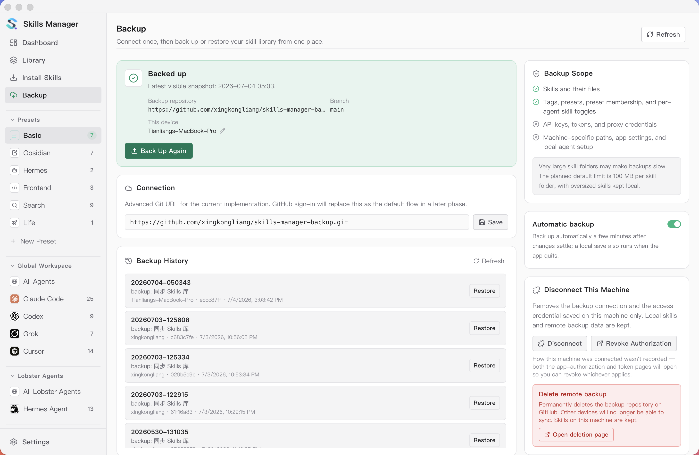
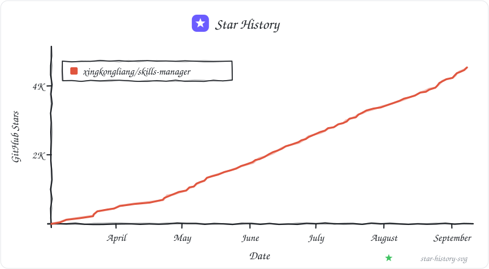

<p align="center">
  
</p>

<h1 align="center">Skills Manager</h1>

<p align="center">
  One app to manage AI agent skills across all your coding tools.
</p>

<p align="center">
  <strong><a href="https://skillsmanager.dev">skillsmanager.dev</a></strong>
</p>

<p align="center">
  🎬 <a href="https://www.youtube.com/watch?v=wfbCrfNASVU">Video intro (YouTube)</a>
  &nbsp;·&nbsp;
  <a href="https://www.bilibili.com/video/BV1845F6REUu/">视频介绍 (Bilibili)</a>
</p>

<p align="center">
  <a href="./README.zh-CN.md">中文说明</a>
  &nbsp;·&nbsp;
  <a href="https://x.com/JayTL00">@JayTL00 on X</a>
  &nbsp;·&nbsp;
  <a href="https://buymeacoffee.com/jaytl">Buy me a coffee</a>
</p>

<p align="center">
  <a href="https://trendshift.io/repositories/23290?utm_source=repository-badge&amp;utm_medium=badge&amp;utm_campaign=badge-repository-23290" target="_blank" rel="noopener noreferrer"></a>
</p>

<p align="center">
  
</p>

<p align="center"><strong>Install Skills — Marketplace</strong></p>
<p align="center"></p>

<p align="center"><strong>Global Workspace</strong></p>
<p align="center"></p>

<p align="center"><strong>Agent Workspace</strong></p>
<p align="center"></p>

<p align="center"><strong>Project Workspace</strong></p>
<p align="center"></p>

<p align="center"><strong>Backup & Multi-Device Sync</strong></p>
<p align="center"></p>

<p align="center"><strong>Settings</strong></p>
<p align="center"></p>

## Features

- **Unified skill library** — Install skills from Git repos, local folders, `.zip` / `.skill` archives, or the [skills.sh](https://skills.sh) marketplace. Everything goes into one central repo, which defaults to `~/.skills-manager` and can be customized in **Settings**.
- **Marketplace + AI search** — Browse popular skills from the marketplace, run keyword search, or enable SkillsMP AI search with your API key.
- **Presets** — Group skills into named presets. In any workspace, click a preset pill to instantly activate or deactivate all its skills for the current agent scope. The sidebar lists all presets for quick access.
- **Global Workspace** — Each agent gets its own page listing every skill in its global folder — including ones installed outside Skills Manager — so the view always reflects what the agent actually sees. Add or remove skills per agent, or use the All Agents overview to manage every installed agent at once.
- **Project Workspaces** — View and manage project-local skill folders for supported agents, compare them with your central library, and sync changes in either direction. Supports nested skill directories and per-agent assignment when exporting.
- **Linked Workspaces** — Point to any directory as a skills root — useful for skills that live outside the default agent paths. Managed as a standalone workspace without participating in global preset sync.
- **Multi-tool sync** — Sync skills to any supported tool via symlink or copy with a single click. Every skill card shows an agent icon badge per enabled agent — click a badge to install or remove that skill for that agent right from the card, with the badge reflecting live sync state.
- **Add from Library sheet** — In any workspace, click **+ Add Skills** to open a unified picker: search your central library, toggle target agents with always-visible chips (with select-all/clear), and batch-add multiple skills in one click.
- **Batch operations** — Multi-select skills for bulk enable/disable, export, or delete. Project Workspaces also support bulk enable/disable for project-local skills.
- **Skill tagging and filters** — Tag skills, use tags to group similar skills, and filter by source or tag — including an **Untagged** pill to quickly find skills missing labels.
- **Update tracking** — Check for upstream updates on Git-based skills; re-import local ones.
- **Skill preview and source inspection** — Read `SKILL.md` / `README.md`, inspect source metadata, and compare local content with the upstream version inside the app.
- **Custom tools** — Add your own agents/tools with custom skills directories, or override the default path for any built-in tool.
- **Backup & multi-device sync** — Connect a private GitHub repository with one sign-in (or any Git remote), and the app backs your library up automatically and keeps all connected devices in sync. Merges are skill-aware — a rename on one machine combines cleanly with an edit on another — and true conflicts never block: your local version stays put until you choose keep mine / use remote / keep both. Snapshot versions are restorable at any time.
- **Activity log & Export Logs** — Install / remove / update / sync operations are recorded locally. Use **Settings → Export Logs** to bundle recent logs and activity history into a single zip for easier issue reports.
- **Flexible app settings** — Configure repo path, sync mode, theme, text size, language, tray behavior, proxy, Git remote, update checks, and the order agents appear throughout the app — all in one place.
- **In-app updates** — The app tells you when a new version is out and installs it for you on macOS and Windows. Nothing downloads or installs on its own: checking only notifies, and installing and restarting each take a click.

## Core Concepts

<p align="center">
  
</p>

- **Presets are reusable skill groups** — A preset is a named collection of skills. Activate a preset in any workspace to add all its skills to the selected agents; deactivate to remove them. Applying a preset is a one-time copy — not a live sync.
- **Global Workspace manages per-agent global skills** — Each installed agent has its own global skills folder (e.g. `~/.claude/skills/` for Claude Code). Each agent page lists everything in that folder — even skills installed without Skills Manager — so you can add, remove, or adopt them; the All Agents overview manages every agent at once.
- **Project Workspaces are project-local skill sets** — A project workspace manages the skills that live inside a specific project (e.g. `<project>/.claude/skills/`). Skills added here only apply to that project.
- **Tags are for grouping and filtering** — Use tags to label similar skills, then filter by tag to find the subset you want quickly.
- **Batch control works everywhere** — Multi-select skills in any workspace for bulk operations.

## Quick Start

1. Install skills from local folders, Git repositories, archives, or the marketplace. If you have a SkillsMP API key, you can also turn on AI search.
2. Open **Global Workspace** from the sidebar and pick an agent (e.g. Claude Code).
3. Click a **Preset** pill to activate its skills for that agent, or use **+ Add Skills** to pick from your library and toggle target agents inline. Active presets show a ✓; partial installs show a count badge.
4. To manage project-local skills, open a **Project Workspace** and use the same preset pills or the **+ Add Skills** picker with its multi-agent target selector.
5. Configure agent paths, custom tools, theme, language, proxy, and Git preferences in **Settings**.
6. If you want history or multi-machine sync, open **Backup** in the sidebar and click **Sign in with GitHub** — backup and cross-device sync run automatically from then on.

## Backup & Multi-Device Sync

The **Backup** page (sidebar) keeps your skill library versioned in a Git repository. One device gets versioned backup with restorable snapshots; several devices connected to the same repository stay in sync with each other automatically. The remote stays a plain Git repository — you can `git clone` it anywhere, no lock-in.

### Connect

- **Sign in with GitHub** (recommended): an 8-digit device-flow sign-in creates a private `skills-manager-backup` repository for you. The token is stored in the OS keychain — never in files or the repo config.
- **Advanced**: paste any Git URL (HTTPS + PAT, SSH, self-hosted) under **Settings → Git Sync Configuration**.
- On a new machine with an empty library, the first launch asks: **start fresh, or restore from a backup?**

### How syncing works

- **Automatic**: local changes are committed and pushed in the background a couple of minutes after you stop editing; updates pushed by your other devices are merged in and pushed back automatically. **Back Up Now** is always available for an immediate run, and every backup in the history shows which device made it.
- **Skill-aware merging**: changes are merged per skill, not per text line — renaming a skill on one machine combines cleanly with editing its content on another.
- **Conflicts never block or overwrite**: if the same skill was edited on two devices at once, everything else syncs normally while that skill keeps your local version and appears under **Needs attention** (also badged on its card in the Library). Pick **keep mine / use remote / keep both** — a safety snapshot is taken before any choice is applied, so every decision is undoable.
- **Snapshots & restore**: manual backups create snapshot versions; open the Backup page history to restore any of them. A restore first saves the current state as its own snapshot.

### What's included

Skills, tags, presets, and per-agent skill toggles are backed up. Secrets (API keys, tokens, proxy settings) and machine-specific wiring never leave the machine. Skills over 100 MB stay local and are excluded from backup automatically (labeled on the Backup page). The SQLite database is not in Git — it stores metadata that is rebuilt from the skill files.

### Disconnecting

The Backup page offers three levels: **disconnect this machine** (other devices and remote data untouched), **revoke the GitHub authorization**, or **delete the remote backup** entirely (routed through GitHub's own type-the-name confirmation).

## Supported Tools

51 agents are supported out of the box, including:

Claude Code · Codex · Cursor · GitHub Copilot · Gemini CLI · OpenCode · OpenClaw · Hermes Agent · OpenHands · Cline · Goose · Windsurf · Continue · Grok · Antigravity · Qwen Code · Crush · Kilo Code · Roo Code · Amp · Kiro CLI · Droid · TRAE IDE · Warp · Qoder · CodeBuddy

**Settings** lists them all, leading with the ones detected on your machine. You can also add custom tools there and manage their skills the same way.

## In-App Help

The **Help** button in **Settings** mirrors the current product flow: recommended workflows, presets, skill installation, the Library (with the Untagged filter and per-card delete), the Global Workspace and the **+ Add Skills** sheet, Project Workspaces with the multi-agent target picker, backup & multi-device sync, and environment-level settings (including Export Logs for issue reports). It is intended as the in-app version of this quick-start guide.

## Tech Stack

| Layer | Tech |
|-------|------|
| Frontend | React 19, TypeScript, Vite, Tailwind CSS |
| Desktop | Tauri 2 |
| Backend | Rust |
| Storage | SQLite (`rusqlite`) |
| i18n | react-i18next |

## Getting Started

### Prerequisites

- Node.js 18+
- Rust toolchain
- [Tauri prerequisites](https://v2.tauri.app/start/prerequisites/) for your OS

### Development

```bash
npm install
npm run tauri:dev
```

### CLI

The repository includes an agent-friendly CLI built on the same Rust shared core used by the desktop app. Both the CLI and the desktop app go through the same SQLite database, central library, and sync engine.

```bash
# Repository / library overview
npm run cli -- repo status
npm run cli -- skills list
npm run cli -- skills show db

# Install skills (default: enter library only — does NOT sync to agents)
npm run cli -- skills install ./my-skill                       # local path
npm run cli -- skills install https://github.com/foo/bar.git   # git URL
npm run cli -- skills install vercel-labs/agent-skills@react-best-practices  # skills.sh
npm run cli -- skills deploy <ref> --agent claude_code --agent codex  # deploy to both agents

# Update / check from upstream (git skills re-clone, local skills re-import source)
npm run cli -- skills update --all
npm run cli -- skills check --all

# Re-point an installed skill at a git source, keeping its id, tags, presets
# and deployments (e.g. a local skill you have since published)
npm run cli -- skills set-source <ref> --git-url https://github.com/you/skills/tree/main/my-skill --dry-run
npm run cli -- skills set-source <ref> --git-url you/skills --subpath my-skill --force

# Search the skills.sh marketplace (no API key needed)
npm run cli -- skills search react --limit 5

# Remove (--yes required; --dry-run available)
npm run cli -- skills remove <ref> --dry-run
npm run cli -- skills remove <ref> --yes

# Organize preset membership (does not change agent files)
npm run cli -- presets add-skill <preset> <ref>
npm run cli -- presets remove-skill <preset> <ref>

# Inspect or change actual per-agent deployments
npm run cli -- skills status <ref>
npm run cli -- skills undeploy <ref> --agent codex --dry-run

# Legacy exclusive active-preset sync
npm run cli -- skills sync --dry-run
npm run cli -- skills sync --tool claude_code

# Adopt skills that already exist in an agent directory (e.g. ~/.claude/skills/)
npm run cli -- skills adopt ~/.claude/skills --dry-run
npm run cli -- skills adopt ~/.claude/skills

# Tag
npm run cli -- skills tag add <ref> web frontend
npm run cli -- skills tag set <ref> web frontend
npm run cli -- skills tag rename frontend web
npm run cli -- skills tag delete obsolete --dry-run
npm run cli -- skills tag list

# Presets (CRUD and membership are organization-only; deploy changes agent files)
npm run cli -- presets list
npm run cli -- presets create "Web Dev" --description "Frontend work"
npm run cli -- presets update "Web Dev" --name Frontend
npm run cli -- presets deploy Frontend --agent codex
npm run cli -- presets undeploy Frontend --agent claude_code
npm run cli -- presets status Frontend
npm run cli -- presets add-skill <preset> <skill>
npm run cli -- presets remove-skill <preset> <skill>

# Export one skill to an arbitrary directory (one-shot copy, not managed)
npm run cli -- skills export db --dest ~/.claude/skills/db

# Git-backed skills repo
npm run cli -- git status
npm run cli -- git pull
npm run cli -- git commit -m "chore: update skills"
```

Available command groups:
- `repo` — inspect or change the configured base directory
- `agents` (`tools` alias) — list agents and globally enable or disable them
- `skills` — manage the central library and real per-agent deployments (`deploy / undeploy / status`)
- `presets` — create, update, delete, organize, deploy, undeploy, and inspect presets
- `git` — operate on the git-backed `skills/` repository (`clone`, `pull`, `push`, `commit`, `versions`, `restore`)

Extra flags:
- `--skills-root <path>` — operate on a cloned/exported skills repo directly instead of the local app default. The manager's state (DB, presets, cache, logs) lives in `~/.skills-manager/external/<name>-<hash>/`, namespaced by the canonical path of the skills root, so the external checkout itself stays clean.
- `--json` — machine-readable output for scripts/agents

```bash
npm run -s cli -- --skills-root /path/to/my-skills --json skills list
```

#### Install the binary on PATH

Agents and scripts that invoke `skills-manager-cli` directly (without `npm run`) need the binary on PATH. Install it with:

```bash
npm run cli:install
# equivalent to:
# cargo install --path src-tauri --bin skills-manager-cli --locked --force
```

This drops the binary at `~/.cargo/bin/skills-manager-cli`. Re-run after pulling updates to refresh it.

Official releases also publish standalone CLI binaries for macOS arm64/x64, Windows x64, and Linux x64. Download the matching `skills-manager-cli-*` asset, make it executable on macOS/Linux, and place it on PATH.

#### Concurrent use with the desktop app

The CLI and desktop app share the same SQLite database and repository lock. The app's filesystem watcher normally refreshes after CLI metadata or deployment changes. If the app was suspended while a command ran, trigger one manual refresh.

### Build

```bash
npm run tauri:build
npm run cli:build
```

## Troubleshooting

### macOS: Gatekeeper blocks the app on first launch (v1.28.5 and earlier)

Releases from **v1.29.0** onward are signed with an Apple Developer ID certificate and notarized by Apple, so they open normally — no warning, no Terminal commands. If you are on an older build, upgrading is the fix.

Releases **up to and including v1.28.5** predate notarization, and macOS blocks them:

<p align="center">
  
</p>

- **"Apple could not verify … is free of malware"** or **"App can't be opened because it is from an unidentified developer"** (v1.20.0 – v1.28.5) — On macOS 15 (Sequoia) the dialog above only offers **Move to Trash** / **Done**: click **Done**, then open **System Settings → Privacy & Security** and click **Open Anyway** (it appears after the first blocked launch). On older macOS you can instead right-click the app in Finder and choose **Open**, then confirm in the dialog.
- **"App is damaged and can't be opened"** (v1.19.0 and earlier) — Run this in Terminal, then open the app again:

  ```bash
  xattr -cr /Applications/skills-manager.app
  ```

  Replace the path with wherever you placed the `.app` file if it's not in `/Applications`.

Upgrading to a notarized build changes the app's code signature, so macOS may ask again for permission to read the `skills-manager-git-backup` keychain entry. Click **Always Allow** — the signing identity is stable from v1.29.0 onward, so later updates should not ask again.

## Star History

<p align="center">
  <a href="https://github.com/xingkongliang/star-history-svg">
    
  </a>
</p>

## License

MIT
